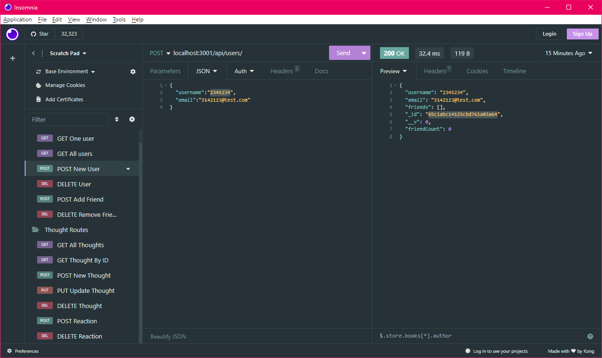

# <Social-Network-Backend>

## Description

The goal of this project was to create a back end for a social network using Express and Mongoose. I created an application that has users, posts ("thoughts"), as well as comments on the posts ("reactions"). Users are also able to add and delete friends. Most of the logic was done in the controllers side of things, allowing for cleaner route files. I also included the package date-fns to easily format dates in posts.

## Installation

After you clone the repo, install the npm packages. After that, ``node index.js`` and you can check out the routes in an application such as Insomnia.

## Usage

After installation, use a program such as Insomnia to test the routes.

## Credits

This project was part of my studies during the KU Full Stack Web Development bootcamp, so I referenced prior in class work to create this.

## License

Please see license in GitHub repo.